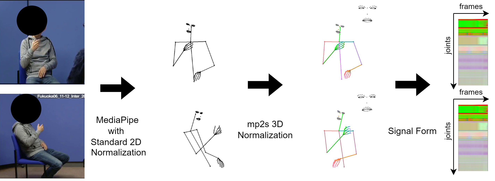
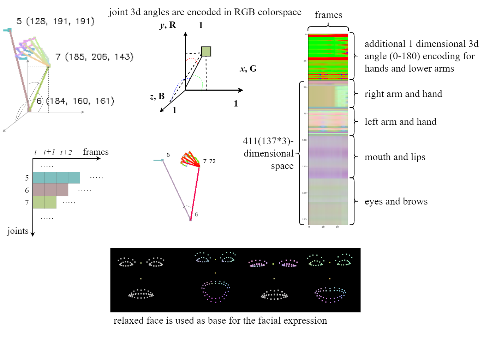

# Mediapipe to Signal 

module for processing [mediapipe's holistic](https://developers.google.com/mediapipe/solutions/vision/holistic_landmarker) model for sign languages.

The module allows extracting pure movement features by:

 - It provides pose normalization in 3D space using  body proportions
 - It rotates the pose toward the camera
 - Sign movement is presented in a series of signals (directional cosine angles per each joint)
 - Sign movement is easily stored, modified, processed, and generated
 - Sign movement can be processed as a signal or as an image
 - It has a "human-readable" representation for quick analysis and intuition. 
 - Simplified data representation speeds up processing and reduces storage.




Converting videos to a series of signals that are easy to read, store, and generate:


 


## Install

```bash
pip install mp2signal
```

## Usage

importing the module:

```python
import mp2signal.mp2s as mp2s
```

Using MediaPipe we process the video and save the normalized signal:

```python
m = mp2s.Movement('path_to_your_signlanguage_video.mp4')
```

The joint signals can be plotted:

```python
import matplotlib.pyplot as plt

human_redable_posegram = m.posegram(human=True)
print(human_redable_posegram.dtype, human_redable_posegram.shape)
plt.imshow(human_redable_posegram)
plt.show()

```

for processing, a two-dimensional version is available in ```uint8``` and ```float```:

```python
machine_uint8_posegram = m.posegram(human=False,signal=False)
print(machine_uint8_posegram.dtype, machine_uint8_posegram.shape)
plt.imshow(machine_uint8_posegram,cmap='brg')
plt.show()

machine_float_posegram = m.posegram(human=False,signal=True)
print(machine_float_posegram.dtype, machine_float_posegram.shape)
plt.imshow(machine_float_posegram,cmap='brg')
plt.show()
```

#### Storing or Generating Movement Data

Sign Language movement is easy to store and generate in the signal form.

```Movement()``` can be initialized with the stored or generated sample:

```python
import numpy as np
np.save('mov_human.npy',human_redable_posegram)
np.save('mov_uin8.npy',machine_uint8_posegram)
np.save('mov_float.npy',machine_float_posegram)

human_redable = np.load('mov_human.npy')
machine_uint8 = np.load('mov_uin8.npy')
machine_float = np.load('mov_float.npy')

hum_restore = mp2s.Movement(human_redable)
hum_rest_gram = hum_restore.posegram(human=True)
print(hum_rest_gram.dtype)
plt.imshow(hum_rest_gram,cmap='brg')
plt.show()

uin8_restore = mp2s.Movement(machine_uint8)
uin8_rest_gram = uin8_restore.posegram(human=False,signal=False)
print(uin8_rest_gram.dtype)
plt.imshow(uin8_rest_gram,cmap='brg')
plt.show()

float_restore_float = mp2s.Movement(machine_float)
float_rest_gram = float_restore_float.posegram(human=False,signal=True)
print(float_rest_gram.dtype)
plt.imshow(float_rest_gram,cmap='brg')
plt.show()
```

#### Signals to Video

You can generate a video with your stored/generated movement signals:


```
video_out = uin8_restore.make_a_video('video_from_signal.mp4')
```

#### Usage with Camera

This script takes input from the web camera and shows rotated and normalized skeleton:

```bash
python examples/mp_live_rot_demo.py
```
